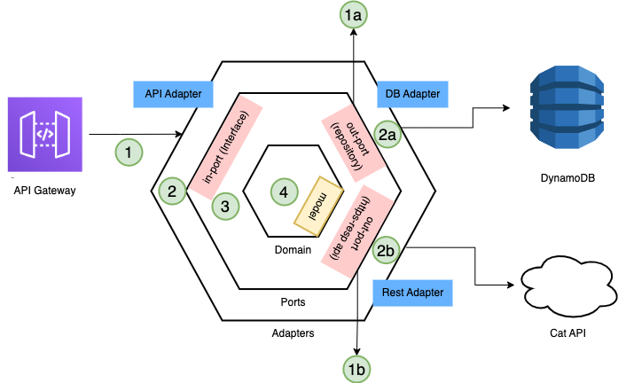

<h1 align="center">cat-api-lambda</h1>
<p align="center">Test case using AWS technologies</p>

<p align="center">
  <p align="center">Table of Contents</p>
  <p align="center">
    <a href="#open_book-about">:open_book: About</a> •
    <a href="#hammer_and_wrench-technologies">:hammer_and_wrench: Technologies</a> • 
    <a href="#checkered_flag-getting-started">:checkered_flag: Getting Started</a> • 
    <a href="#world_map-api-documentation">:world_map: API Documentation</a> 
  </p>
  <p align="center">
    <a href="#building_construction-architecture">:building_construction: Architecture</a> • 
    <a href="#rocket-deploy">:rocket: Deploy</a> •
    <a href="#pencil-logs">:pencil: Logs</a> •
    <a href="#test_tube-unit-tests">:test_tube: Unit tests</a> •
    <a href="#books-references">:books: References</a>
  </p>
</p>

## :open_book: About

This project contains source code and supporting files for a serverless application that consumes [The Cat API](https://thecatapi.com/) and it can deploy with the SAM CLI. It includes the following files and folders.

- api - Code for the application's Lambda function.
- events - Invocation events that you can use to invoke the function.
- tests - Unit tests for the application code.
- template.yaml - A template that defines the application's AWS resources.
- docker-compose.yaml - A template that defines a service to run DynamoDB locally

If you prefer to use an integrated development environment (IDE) to build and test your application, you can use the AWS Toolkit.  
The AWS Toolkit is an open source plug-in for popular IDEs that uses the SAM CLI to build and deploy serverless applications on AWS. The AWS Toolkit also adds a simplified step-through debugging experience for Lambda function code. See the following links to get started.

- [PyCharm](https://docs.aws.amazon.com/toolkit-for-jetbrains/latest/userguide/welcome.html)
- [VS Code](https://docs.aws.amazon.com/toolkit-for-vscode/latest/userguide/welcome.html)

## :hammer_and_wrench: Technologies

The application uses:

- AWS resources: **Lambda functions**, **API Gateway API**, **DynamoDB**, **CloudWatch**.
- Python 3.8
- FastAPI
- Requests
- Pytest
- GitHub Actions

These technologies were chosen based on the following requirements

> Considere que as aplicações descritas nesse case terão:
>
> 1. Volumetria máxima de 500 requisições por dia.
> 2. Requisições acontecem em sua grande parte do tempo em horário comercial durante dias úteis.
>
> Considere que para o produto é importante:
>
> 1.  Estar sempre disponível pro cliente
> 2.  Baixo custo pro cliente
> 3.  Tempo de resposta menor de 500ms
> 4.  Acompanhar a saúde da plataforma

## :checkered_flag: Getting Started

Before we begin, you need to have few things installed:

- [AWS CLI](https://aws.amazon.com/cli/)
- [SAM CLI](https://docs.aws.amazon.com/serverless-application-model/latest/developerguide/serverless-sam-cli-install.html)
- [Docker](https://hub.docker.com/search/?type=edition&offering=community)
- [Python 3.8](https://www.python.org/downloads/release/python-3815/)

First, we need to build the application:

```bash
cat-api-lambda$ sam build --use-container
```

After that, we need to build the docker containing DynamoDB (Make sure Docker Desktop is running)

```bash
cat-api-lambda$ docker-compose up -d
```

Then, we start the api with the following params (you may need to config aws_credentials)

```bash
cat-api-lambda$ sam local start-api --docker-network local-dynamodb --skip-pull-image --profile default --parameter-overrides 'ParameterKey=StageName,ParameterValue=local'
cat-api-lambda$ curl http://localhost:3000/
```

The SAM CLI reads the application template to determine the API's routes and the functions that they invoke. The `Events` property on each function's definition includes the route and method for each path.

```yaml
Events:
  CatApi:
    Type: Api
    Properties:
      Path: /{proxy+}
      Method: any
```

You should get a response like:

```json
{
  "ok": true
}
```

(It may take a while depending on your local machine configurations)

Finally, we create the table **breed**:

```bash
cat-api-lambda$ aws dynamodb create-table --cli-input-json file://create-local-db.json --endpoint-url http://localhost:8000
```

## :world_map: API Documentation

#### prod url: https://j3u8hj1azh.execute-api.us-east-2.amazonaws.com/Prod/
#### local url: http://localhost:3000/

| HTTP Verbs | Endpoints | Body | Action |
| --- | --- | --- | --- |
| GET | / | - | ping to check if the serve is up |
| GET | /cat-api/breeds | - | direct call to the cat api - returns the first 10 breeds |
| GET | /api/breeds/{breed_id} | - | get breed by id |
| GET | /api/breeds/fetch/save | - | fetches the cat api and saves the firts 10 breeds in the dynamodb |
| PATCH | /api/breeds/{breed_id} | breed_name, description, life_span, temperament, origin | updates a field |
| DELETE | /api/breeds/{breed_id} | - | deletes a breed by id |

The db in production conatins two breed_ids to test:
- ***90931c59-8180-4d21-9c53-450358c99d37***
- ***128a6907-bbcb-4c2a-95fc-5c78d625ab4f***

## :building_construction: Architecture

Hexagonal architecture is also known as the ports and adapters architecture. It is an architectural pattern used for encapsulating domain logic and decoupling it from other implementation details, such as infrastructure or client requests.

- Domain logic: Represents the task that the application should perform, abstracting any interaction with the external world.
- Ports: Provide a way for the primary actors (on the left) to interact with the application, via the domain logic. The domain logic also uses ports for interacting with secondary actors (on the right) when needed.
- Adapters: A design pattern for transforming one interface into another interface. They wrap the logic for interacting with a primary or secondary actor.
- Primary actors: Users of the system such as a webhook, a UI request, or a test script. Secondary actors: used by the application, these services are either a Repository (for example, a database) or a Recipient (such as a message queue).

<p align="center">
  
</p>

1- A client makes a request to the API Gateway endpoint (e.g. /api/fetch-save/breeds), which invokes the Lambda function.

2- The primary adapter receives the request. I calls the port.

3- The port is an interface for communicating with the domain logic. It enforces the separation between an adapter and the domain logic. With this approach, you can change and test the infrastructure and domain logic in isolation without impacting another part of the code base.

4- The port calls the logic entry point. The domain requests the breeds data from the cat-api. Then it saves the breeds data values to the DynamoDB table. The domain logic always uses a port to interact with an adapter because the ports are the interfaces with the external world.

1a- The domain logic uses the Repository port for interacting with the database. There is not a direct connection between the domain and the adapter.

2a- The secondary adapter encapsulates the logic for reading an item from a DynamoDB table. All the logic for interacting with DynamoDB is encapsulated in this module.

1b- The second operation in the business logic is retrieving the cat breeds. The domain logic requests the operation via a port that proxies the request to the adapter:

2b- The cat-api service adapter fetches the data from a third-party endpoint and returns the result to the domain logic.

## :rocket: Deploy

### Running in your shell:

To build and deploy your application for the first time, run the following in your shell:

```bash
sam build
sam deploy --no-confirm-changeset --no-fail-on-empty-changeset --region us-east-2 --stack-name cat-api-lambda --resolve-s3 --capabilities CAPABILITY_IAM
```

The first command will build the source of your application. The second command will package and deploy the application to AWS.

You can find the API Gateway Endpoint URL in the output values displayed after deployment.
(https://j3u8hj1azh.execute-api.us-east-2.amazonaws.com/Prod/)

### Running in the repo:

Any push to the main branch triggers a job that tests and deploy the application to AWS

## :pencil: Logs

To simplify troubleshooting, SAM CLI has a command called `sam logs`. `sam logs` lets you fetch logs generated by your deployed Lambda function from the command line. In addition to printing the logs on the terminal, this command has several nifty features to help you quickly find the bug.

`NOTE`: This command works for all AWS Lambda functions; not just the ones you deploy using SAM.

```bash
cat-api-lambda$ sam logs -n CatApiTestFunction --stack-name cat-api-lambda --tail
```

You can find more information and examples about filtering Lambda function logs in the [SAM CLI Documentation](https://docs.aws.amazon.com/serverless-application-model/latest/developerguide/serverless-sam-cli-logging.html).

## :test_tube: Unit tests

Tests are defined in the `tests` folder in this project. Use PIP to install the [pytest](https://docs.pytest.org/en/latest/) and run unit tests.

```bash
cat-api-lambda$ pip install pytest pytest-mock --user
cat-api-lambda$ pytest tests/
```

## :books: References

- [Developing evolutionary architecture with AWS Lambda](https://aws.amazon.com/blogs/compute/developing-evolutionary-architecture-with-aws-lambda/)
- [Serverless Hexagonal Architecture](https://muthuveerappan-v.medium.com/serverless-hexagonal-architecture-python-79eb05477a09)
- [Tutorial: Deploying a Hello World application](https://docs.aws.amazon.com/serverless-application-model/latest/developerguide/serverless-getting-started-hello-world.html)
- [Deploying DynamoDB locally on your computer](https://docs.aws.amazon.com/amazondynamodb/latest/developerguide/DynamoDBLocal.DownloadingAndRunning.html)
- [Importing an existing data model](https://docs.aws.amazon.com/amazondynamodb/latest/developerguide/workbench.Modeler.ImportExisting.html)
